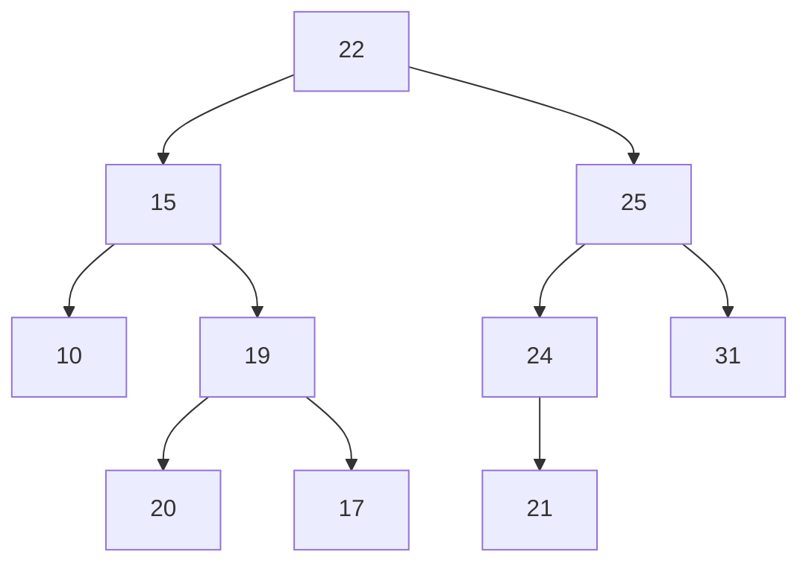
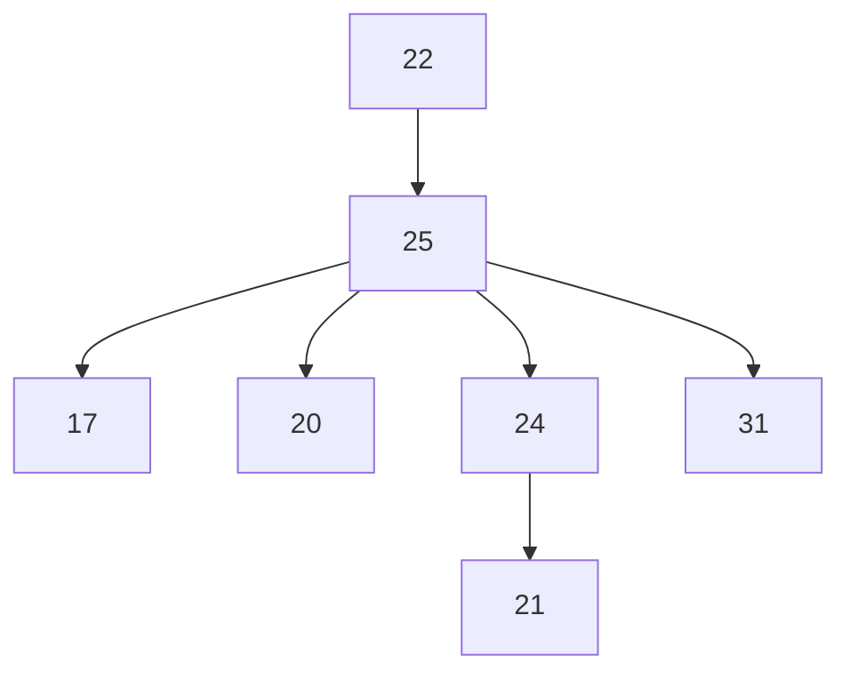

# Problem

## construct a BST putting the following key one after another: 22, 15, 25, 31, 19, 20, 10, 17, 24, 21

# Solution

## Construct the tree

## Now From the constructed tree, delete the following element one after another: 10, 19, 15, 22

