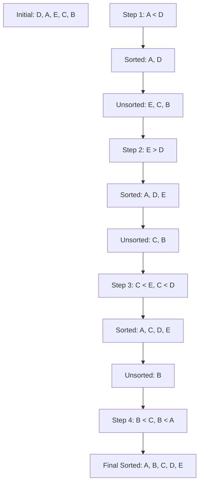
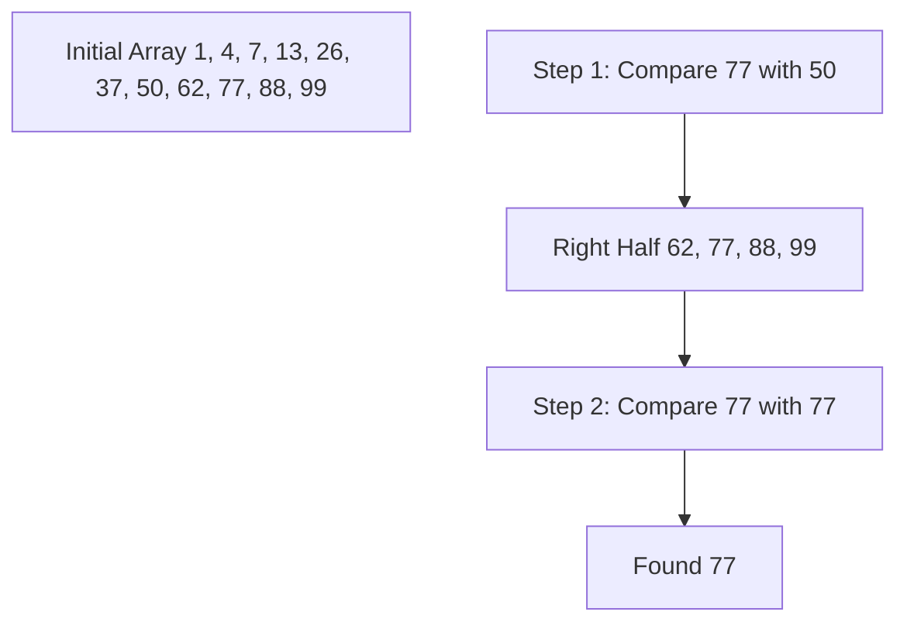

## A2

```mermaid
graph TD
  A[Initial: D, A, E, C, B]

  A1[Step 1: A < D] --> B1[Sorted: A, D] --> B2[Unsorted: E, C, B]

  B2 --> C1[Step 2: E > D] --> C2[Sorted: A, D, E] --> C3[Unsorted: C, B]

  C3 --> D1[Step 3: C < E, C < D] --> D2[Sorted: A, C, D, E] --> D3[Unsorted: B]

  D3 --> E1[Step 4: B < C, B < A] --> E2[Final Sorted: A, B, C, D, E]
```

## A3

```mermaid
graph TD
  A[Initial Array 1, 4, 7, 13, 26, 37, 50, 62, 77, 88, 99]

  A1[Step 1: Compare 77 with 50] --> B1[Right Half 62, 77, 88, 99]

  B1 --> C1[Step 2: Compare 77 with 77] --> C2[Found 77]
```
